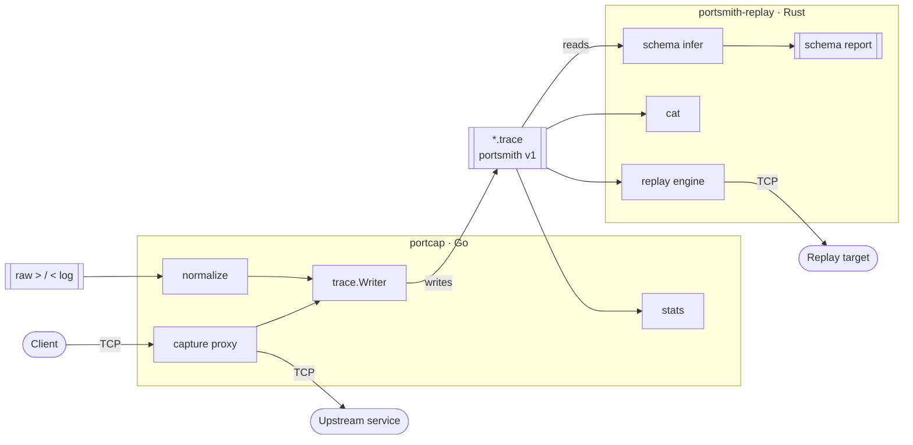

<!-- portsmith — protocol cartographer's field manual -->
<p align="center">
  
</p>

<h1 align="center">portsmith</h1>

<p align="center">
  <strong>Protocol discovery &amp; replay for line-based network traffic.</strong><br>
  <em>Put an unknown wire protocol on the bench, watch its waveform, chart its schema, and replay it.</em>
</p>

<p align="center">
  <code>capture</code> &#8594; <code>normalize</code> &#8594; <code>infer</code> &#8594; <code>replay</code> &#183;
  <code>Go</code> + <code>Rust</code> &#183; standard libraries only &#183; MIT
</p>

---

## Field manual

You have a TCP service with no spec — an undocumented daemon, a vendor box that
speaks its own dialect, a Redis-flavoured thing you want to regression-test. You
have a socket, not a document.

**portsmith is the bench kit for that socket.** It treats an opaque protocol the
way an electronics workshop treats an unknown signal: clip a probe onto the wire
(`capture`), tidy the recording into a clean trace (`normalize`), read the
waveform and chart its structure (`infer`), then drive the same stimulus back
into a live device (`replay`). No protocol-specific code, no dependency tree —
two small binaries, each in the language that suits its job, exchanging one
documented text format.

> **Not** a Wireshark, a fuzzer, or a full reverse-engineering suite. portsmith
> is a focused, auditable toolchain for line-oriented request/response traffic
> you can read end-to-end in an afternoon.

---

## Table of contents

- [Why portsmith](#why-portsmith)
- [The two instruments](#the-two-instruments)
- [Install &amp; build](#install--build)
- [Bench session (annotated transcript)](#bench-session-annotated-transcript)
- [The trace format, walked field by field](#the-trace-format-walked-field-by-field)
- [Architecture](#architecture)
- [Trace flow](#trace-flow)
- [Command reference](#command-reference)
- [Workflows](#workflows)
- [Use cases](#use-cases)
- [How inference actually works](#how-inference-actually-works)
- [How replay actually works](#how-replay-actually-works)
- [Design choices](#design-choices)
- [Comparison](#comparison)
- [Limitations](#limitations)
- [Troubleshooting](#troubleshooting)
- [Repository layout](#repository-layout)
- [Roadmap](#roadmap)
- [License](#license)

---

## Why portsmith

Most protocol tooling assumes you already know the protocol. portsmith assumes
you do not, and optimizes for the *discovery loop*:

- **Two languages, deliberately.** Capture and normalization are I/O-and-goroutine
  heavy — Go's home turf (`portcap`). Inference and replay want a tight,
  allocation-conscious core with strong pattern matching — Rust
  (`portsmith-replay`). Neither reaches for a third-party crate or module.
- **One contract between them.** The `*.trace` file is the *only* coupling. Both
  sides implement the same v1 grammar against their standard libraries, including
  a hand-rolled standard-base64 codec on the Rust side.
- **Everything is inspectable.** Traces are UTF-8 text; payloads are base64 so a
  single grep-able line survives binary data and embedded NULs. Schema reports and
  replay output are plain text, made for humans and pipes alike.

---

## The two instruments

| Instrument | Language | Role on the bench | Subcommands |
|------------|----------|-------------------|-------------|
| **`portcap`** | Go | The probe &amp; recorder. Sits in front of a TCP service as a transparent proxy and records both directions; also normalizes loose logs and summarizes traces. | `capture`, `normalize`, `stats`, `version` |
| **`portsmith-replay`** | Rust | The scope &amp; signal generator. Reads a trace, infers the protocol's structure, pretty-prints it, and replays captured requests against a live target. | `infer`, `replay`, `cat`, `version` |

Both tools report version `1.0.0`.

---

## Install &amp; build

Prerequisites: **Go 1.24** and a **stable Rust toolchain** (`cargo`).

```sh
make build        # builds the Go binary (bin/portcap) and the Rust release binary
make test         # runs `go test ./...` and `cargo test`
```

Prefer to drive each toolchain yourself:

```sh
cd go   && go build -o ../bin/portcap ./cmd/portcap
cd rust && cargo build --release        # target/release/portsmith-replay
```

Other Makefile targets that mirror CI:

```sh
make fmt     # go fmt ./...            + cargo fmt
make vet     # go vet ./...            + cargo check
make demo    # regenerate samples/redis.trace, then infer it
make clean   # remove bin/ and cargo artifacts
```

CI (`.github/workflows/ci.yml`) runs three jobs: **Go** (gofmt check, `go vet`,
build, `go test -race`), **Rust** (`cargo fmt --check`, `clippy -D warnings`,
release build, `cargo test`), and a **cross-language interop** job that
normalizes a log with Go and infers it with Rust — proving the format contract
holds across both implementations.

> Transcripts below use bare `portcap` / `portsmith-replay` names. Substitute
> `bin/portcap` and `target/release/portsmith-replay`, or add them to `PATH`.

---

## Bench session (annotated transcript)

A complete loop on the bundled Redis sample — no Redis-specific code anywhere in
portsmith.

**1 &#183; Normalize a raw session log into a canonical trace.** The `redis.log`
uses `>` for client lines and `<` for server lines; consecutive same-direction
lines are coalesced into one record and timestamps are synthesized from
`-start` stepping by `-step`.

```console
$ portcap normalize -in samples/redis.log -proto redis -session a1b2c3 \
      -start 1700000000000000000 -step 50000000 -out samples/redis.trace
# normalized 6 records
```

**2 &#183; Read the trace back as escaped, human-readable text** (`cat` shows the
nanosecond timestamp, direction arrow, session, proto, and a control-escaped
preview of up to 64 payload bytes):

```console
$ portsmith-replay cat -in samples/redis.trace
 1700000000000000000 -> a1b2c3     redis  PING\n
 1700000000050000000 <- a1b2c3     redis  +PONG\n
 1700000000100000000 -> a1b2c3     redis  SET key1 hi\n
 1700000000150000000 <- a1b2c3     redis  +OK\n
 1700000000200000000 -> a1b2c3     redis  GET key1\n
 1700000000250000000 <- a1b2c3     redis  $2\nhi\n
```

**3 &#183; Chart the protocol's structure.** Inference groups records by
`(proto, direction)` and reports encoding, terminator, length statistics, and the
leading-token histogram (sorted by count, then name):

```console
$ portsmith-replay infer -in samples/redis.trace
portsmith schema inference
==========================

[redis request]
  samples    : 3
  encoding   : text
  terminator : LF
  length     : min=5 max=12 mean=8.7
  tokens     :
    GET              1
    PING             1
    SET              1

[redis response]
  samples    : 3
  encoding   : text
  terminator : LF
  length     : min=4 max=6 mean=5.3
  tokens     :
    $2               1
    +OK              1
    +PONG            1
```

**4 &#183; Summarize the recording** with `stats` (counts, byte totals, distinct
sessions, wall-clock span, protocol breakdown):

```console
$ portcap stats -in samples/redis.trace
records:   6
requests:  3
responses: 3
sessions:  1
bytes:     42
duration:  250ms
protocols:
  redis    6
```

**5 &#183; Replay the captured requests against a live server.** Only *request*
records are sent; each line shows request/response byte counts and a preview, and
a summary closes the run:

```console
$ portsmith-replay replay -in samples/redis.trace -target 127.0.0.1:6379
[a1b2c3] 5 bytes -> 5 bytes | +PONG\r\n
[a1b2c3] 12 bytes -> 5 bytes | +OK\r\n
[a1b2c3] 9 bytes -> 9 bytes | $2\r\nhi\r\n
replayed 3 request(s), 0 error(s), sent 26 byte(s), received 19 byte(s)
```

**6 &#183; Or clip the probe onto a live service** and record real traffic while a
client talks through the proxy:

```console
$ portcap capture -listen :9000 -target 127.0.0.1:6379 -proto redis -out cap.trace
# capturing :9000 -> 127.0.0.1:6379 (proto=redis) to cap.trace
# ...point a client at localhost:9000...
```

---

## The trace format, walked field by field

The trace is the single contract between the two tools. It is line-oriented
UTF-8 so both standard libraries can parse it trivially. The authoritative spec
lives in [`docs/FORMAT.md`](docs/FORMAT.md); here is the working reading of it.

A file is a recommended magic comment, any number of comments/blank lines, then
one record per line:

```
#portsmith-trace v1
V1 1700000000000000000 > a1b2c3 redis 5 UElORwo=
V1 1700000000050000000 < a1b2c3 redis 6 K1BPTkcK
```

Each record is seven space-separated fields. Because the payload is base64 it
contains no spaces, so a decoder splits on the **first six spaces** (`splitn(7)`):

```
V1   1700000000000000000   >   a1b2c3   redis   5   UElORwo=
│    │                     │   │        │       │   │
│    │                     │   │        │       │   └─ payload  base64(raw bytes) → "PING\n"
│    │                     │   │        │       └───── len      decimal length of the DECODED payload (5)
│    │                     │   │        └───────────── proto    protocol hint: tcp | http | redis | raw | …
│    │                     │   └────────────────────── session  opaque id, no spaces
│    │                     └────────────────────────── dir      ">" request (client→server) | "<" response
│    └──────────────────────────────────────────────── ts_nanos int64 nanoseconds since the Unix epoch
└───────────────────────────────────────────────────── version  literal "V1"
```

The `len` field is redundant with the payload **on purpose** — it lets a reader
detect truncation or corruption *before* allocating. Both decoders reject a
record when it does not split into exactly 7 fields, the version is not `V1`,
`ts_nanos` is not a valid int64, `dir` is neither `>` nor `<`, `len` is not a
valid non-negative integer, the base64 is invalid, or **the decoded length does
not match `len`**.

Other rules both implementations honor: line separator is `\n` (a trailing `\r`
is tolerated); blank/`#`-comment lines are ignored; the magic header is a comment
(recommended, not required); base64 is *standard* (`+`/`/`, `=` padding), with the
Rust side shipping its own known-answer-tested codec so it needs no crates; and
future revisions bump the version tag (`V2`, …) rather than being guessed at.

---

## Architecture

The `*.trace` file is the waist of the hourglass: Go writes it, Rust reads it,
and nothing else crosses the boundary.



*(Mermaid is used sparingly here; the animated SVGs below carry the visual load.)*

---

## Trace flow

The full pipeline as a workshop schematic — raw log tidied into base64 records,
records charted into a schema, requests driven back onto the wire:

<p align="center">
  
</p>

---

## Command reference

### `portcap` (Go)

| Command | Purpose | Key flags |
|---------|---------|-----------|
| `capture` | Transparent TCP proxy; records both directions to a trace. | `-listen` (default `:9000`), `-target` (**required**, `host:port`), `-proto` (default `tcp`), `-out` (default `-` = stdout), `-max` (stop after N connections; `0` = unlimited) |
| `normalize` | Convert a `> / <` raw session log into a canonical trace. | `-in` (default `-` = stdin), `-proto` (default `raw`), `-session` (default `norm0001`), `-out` (default `-`), `-start` (default: now, unix nanos), `-step` (default `1ms` in nanos) |
| `stats` | Summarize a trace: records, requests/responses, sessions, bytes, duration, protocol breakdown. | `-in` (default `-`) |
| `version` | Print `portcap 1.0.0`. | — |

### `portsmith-replay` (Rust)

| Command | Purpose | Key flags |
|---------|---------|-----------|
| `infer` | Heuristically discover the schema of each `(proto, direction)` group. | `-in` (default `-` = stdin) |
| `replay` | Send captured **requests** to a target; collect responses. | `-target` (**required**), `-timing` (preserve inter-request delays, capped at 2s), `-timeout` (per-read timeout ms, default `200`), `-wait` (max wait for a response ms, default `500`), `-in` (default `-`) |
| `cat` | Pretty-print a trace with control characters escaped. | `-in` (default `-`) |
| `version` | Print `portsmith-replay 1.0.0`. | — |

Run any command with `-h` for its flags. Both tools accept `-` (or an omitted
`-in`) to read from **stdin**, and Go's `-out`/Rust's stdout make them
pipe-friendly:

```sh
portcap normalize -in samples/redis.log -proto redis | portsmith-replay infer -in -
```

---

## Workflows

**A · From a hand-written log to a schema.** Fastest way to sketch a protocol you
can describe but not yet capture. Write a `> / <` log, normalize it, infer it.

